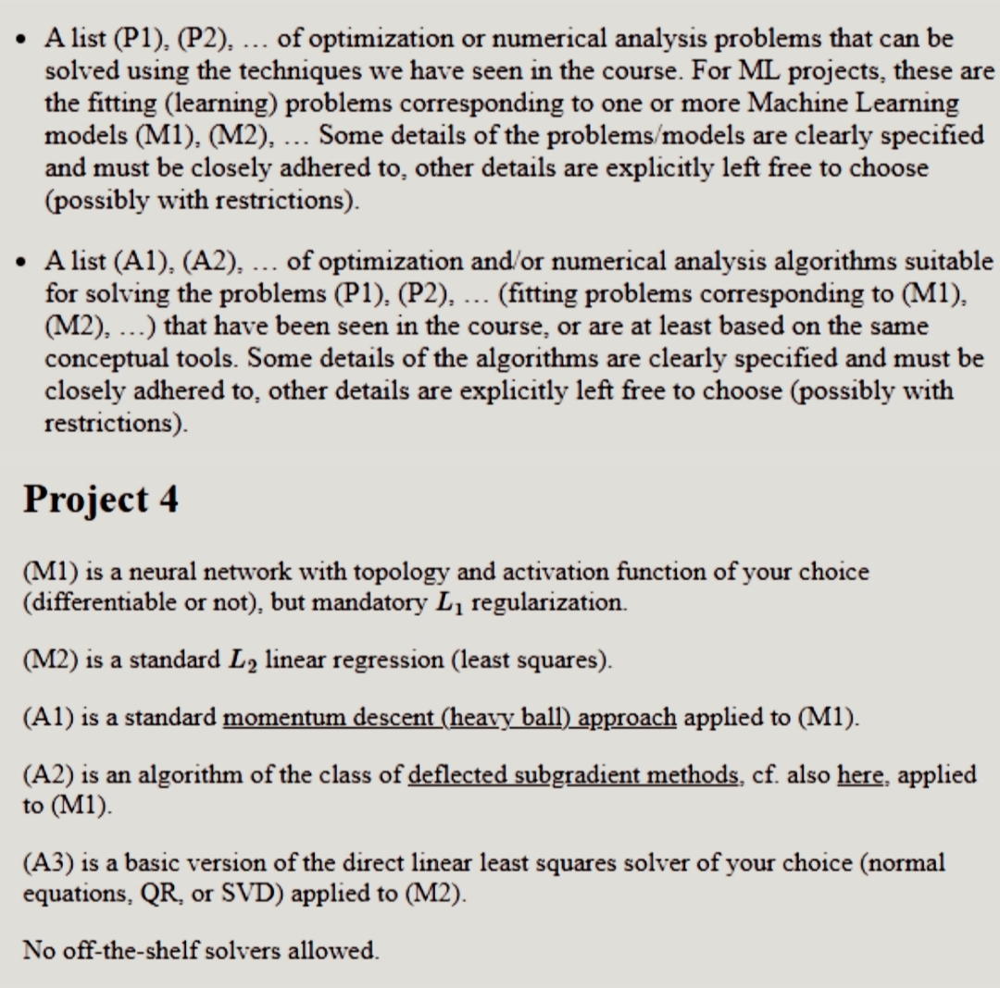

# CM – Group 48 (Project 4 ML)

Giorgio Chelli, Massimo Monai – A.Y. 2025/2026

<br>

Project Track:

<br>



<br>

## Files that run the models

The following scripts need the installation of a `MATLAB` environment, along with the `Machine Learning and Statistical Toolbox` and `Parallel Computation Toolbox` extensions:

<br>

- For algorithm A3, the following file can be found in `CM/src/`:

```
Least_Squares_QR.m
```

<br>

- For algorithm A2, the following file can be found in `lib/Subgradient_Networks`:

```
SubgradientGridSearch.m
```

<br>

- For algorithm A1, the following file can be found in `lib/HeavyBall_Networks`:

```
HeavyBallGridSearch.m
```

<br>

The grid search files have multiple uses:

- can be used to train each possible combination of specified values of hyperparameters for an algorithm, saving each resulting model and performance plot;

<br>

- can be used to retrain a saved model later, or simply reproduce the run of a model in a deterministic way, allowing consistent results for our experiments.

## SubgradientGridSearch

```
grid_search(use_deflection, retraining, filename, fold_bool)
```

<br>

where:

- `use_deflection`: 1 = Volume Algorithm, 0 = pure subgradient;

<br>

- `retraining`, `filename`: to reuse the initial weights stored in a saved model (`best_lambda0_001` are the weights used for experiments in the report);

<br>

- `fold_bool`: used for Cross-Validation in ML project, fix to 0.

## HeavyBallGridSearch

```
grid_search(retraining, filename, fold_bool)
```

<br>

where:

- `retraining`, `filename`: to reuse the initial weights stored in a saved model (`best_lambda0_001` are the weights used for experiments in the report);

<br>

- `fold_bool`: used for Cross-Validation in ML project, fix to 0.
